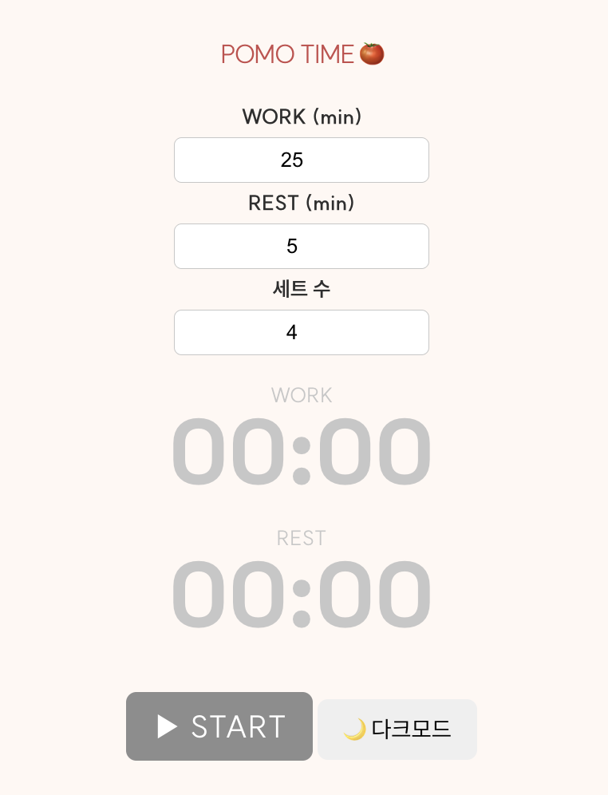
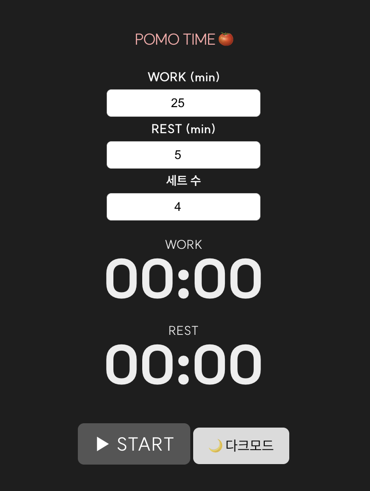
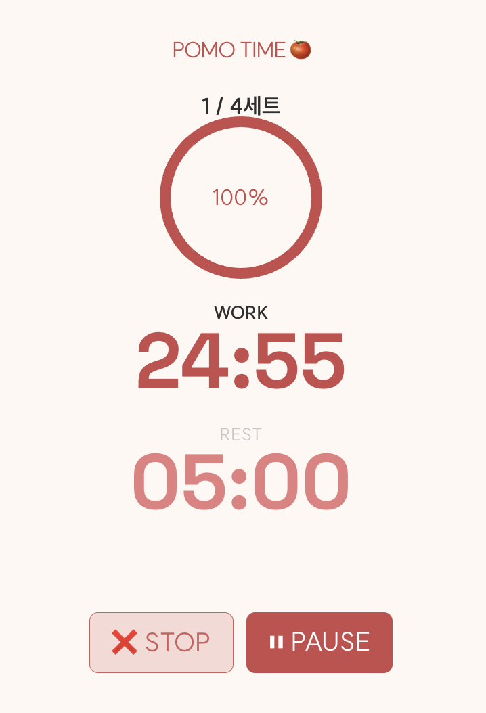
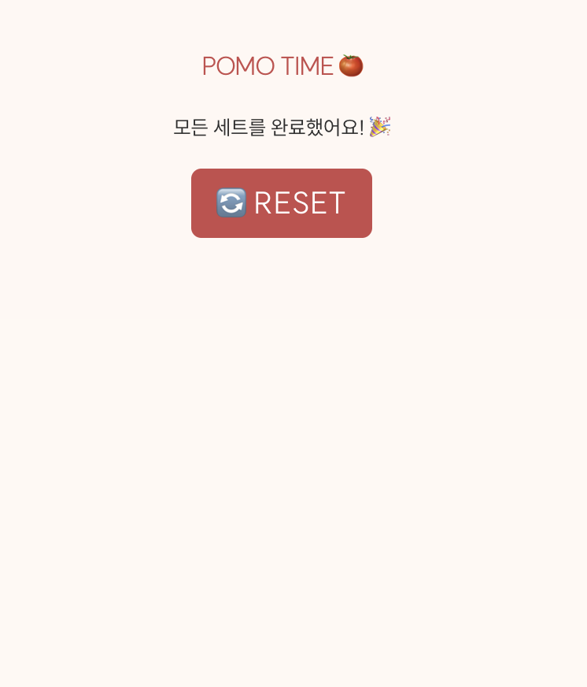

# ⏱️ POMO TIME 🍅 - 웹 기반 뽀모도로 집중 타이머 앱

**POMO TIME 🍅**은 뽀모도로 기법을 기반으로 한 웹 애플리케이션으로, 집중력 향상과 효율적인 시간 관리를 지원합니다.  
HTML, CSS, JavaScript로 타이머를 직접 구현하고, Flask 백엔드를 통해 세션 기록과 통계 기능을 확장하였습니다.


---

## 🔍 프로젝트 개요

- **프로젝트명**: POMO TIME 🍅
- **기획 의도**: 집중력 향상 및 작업 몰입을 위한 뽀모도로 타이머 + 기록 추적 시스템
- **개발 포인트**:
  - **순수 JavaScript 기반 타이머 로직**
  - **Flask 기반 백엔드 연동 (기록 저장, 통계 API)**
  - **세트 반복 / 자동 전환 / UI 알림 효과**
  - **다크모드 및 시각화 인터페이스 적용**

---

## 🧩 주요 기능

| 기능 | 설명 |
|------|------|
| 🎯 타이머 반복 | 작업 시간 → 휴식 시간 자동 전환 (반복 지원) |
| 📦 세트 수 설정 | 예: 4세트 완료 후 긴 휴식 제공 |
| 🔄 세트 진행 표시 | "2 / 4세트" 등 현재 세트 표시 |
| 🟢 원형 프로그래스바 | 타이머 진행률을 시각적으로 표현 |
| 🔔 알림 텍스트 | 각 세션 종료 시 피드백 안내 |
| 🌙 다크모드 지원 | 버튼 클릭으로 다크/라이트 전환 |
| 🧠 기록 저장 (Flask) | 타이머 종료 시 Work/Rest 세션 DB 저장 |
| 📊 통계 API 제공 | `/stats/today` 요청 시 오늘 집중 시간 반환 |
| 🇰🇷 한국 시간 기록 | 기록 시 `2025년 04월 15일 13시 00분 00초` 형식 저장 |

---


## 🖼️ 화면 구성 미리보기


<table>
  <tr>
    <td align="center"><b>기본 화면</b></td>
    <td align="center"><b>다크 모드</b></td>
  </tr>
  <tr>
    <td></td>
    <td></td>
  </tr>
  <tr>
    <td align="center"><b>진행 중</b></td>
    <td align="center"><b>완료 화면</b></td>
  </tr>
  <tr>
    <td></td>
    <td></td>
  </tr>
</table>

> 📌 위 이미지는 실제 작동 UI를 기준으로 캡처한 것입니다.

---

## 🛠 기술 스택

- **Frontend**: HTML5, CSS3, JavaScript (Vanilla)
- **Backend**: Python, Flask, SQLite
- **디자인 기반**: Figma → 직접 CSS 구현
- **시각화**: SVG 기반 원형 진행률 애니메이션
- **기록 저장 형식**: `2025년 04월 15일 13시 53분 04초` (한국 시간)

---

## 📁 폴더 구조 예시

```bash
POMP_TIME_/
├── .gitignore
├── README.md
├── backend/
│   ├── app.py
│   ├── config.py
│   ├── requirements.txt
│   ├── models/
│   │   └── log.py
│   ├── routes/
│   │   ├── log_routes.py
│   │   └── stats_routes.py
├── static/
│   ├── script.js
│   ├── style.css
│   ├── global.css
│   ├── styleguide.css
│   └── assets/
│       ├── screen_default.png
│       ├── screen_darkmode.png
│       ├── screen_running.png
│       └── screen_done.png
├── templates/
│   └── index.html

---

## 🚀 향후 개선 계획

	•	⏳ 커스텀 세션 시간 설정 기능 (ex. 30분 작업 → 10분 휴식)
	•	🔔 알림 소리 지원 (브라우저 Audio API)
	•	📊 누적 집중 시간 시각화 (차트/그래프)
	•	📝 /history 페이지로 날짜별 기록 리스트 출력
	•	📱 모바일 UI 개선 + PWA 기능 적용 (앱 설치 가능하게)

---

## 🙋‍♂️ 프로젝트 제작자

- **이름**: dev-parkjs  
- **GitHub**: [https://github.com/dev-parkjs](https://github.com/dev-parkjs)

---

> 본 프로젝트는 시간 관리를 돕는 * 직관적이고 기록 가능한 뽀모도로 타이머 *를 목표로 제작되었습니다. 순수 프론트엔드 구현 이후 Flask 백엔드 연동을 통해, 사용자의 집중 기록을 저장하고 추적하는 기능까지 확장하고 있습니다.

