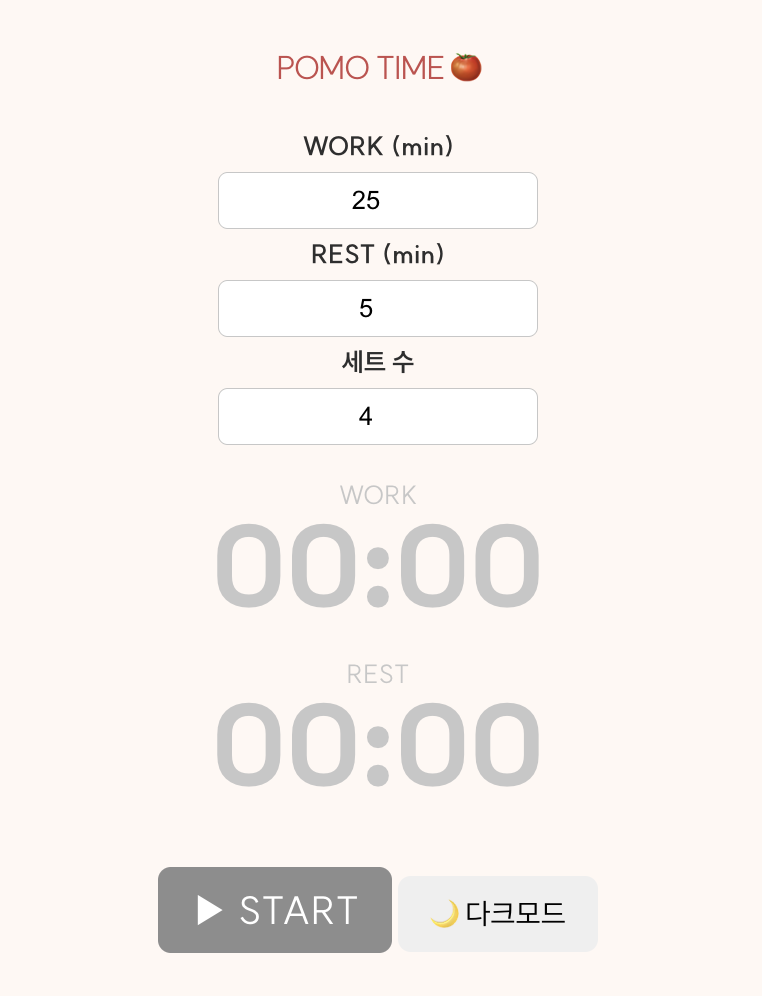
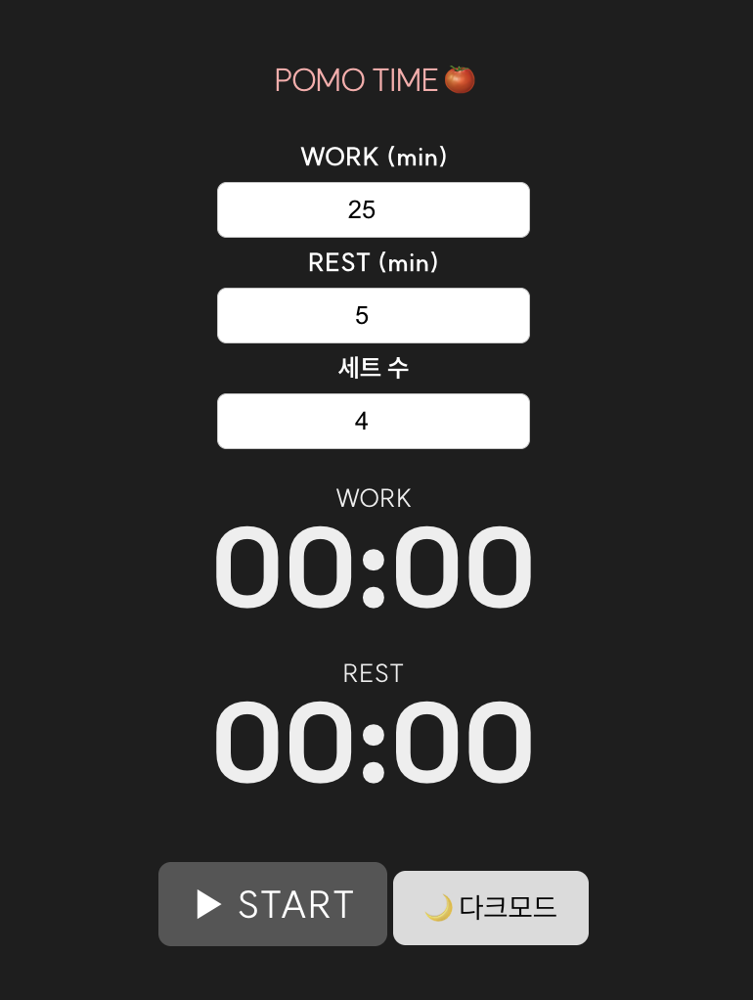
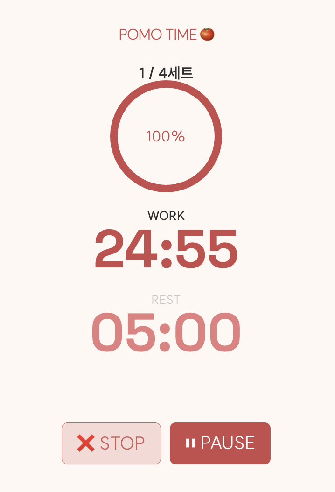

# ⏱️ POMO TIME 🍅 - 웹 기반 뽀모도로 집중 타이머 앱

**POMO TIME 🍅**은 뽀모도로 기법을 기반으로 한 웹 애플리케이션으로, 집중력 향상과 효율적인 시간 관리를 지원합니다. HTML, CSS, JavaScript를 활용해 직접 구현하였으며, 세트 반복, 타이머 자동 전환, 알림음 등 다양한 기능을 포함하고 있습니다.

---

## 🔍 프로젝트 개요

- **프로젝트명**: POMO TIME 🍅
- **기획 의도**: 집중력 향상 및 작업 몰입을 위한 뽀모도로 타이머 구현
- **개발 포인트**:
  - **직접 구현한 순수 자바스크립트 타이머**
  - **세트 수 조정 / 반복 기능 / 알림 음향 포함**
  - **다크모드 지원** 및 사용자 친화적인 UI

---

## 🧩 주요 기능

| 기능 | 설명 |
|------|------|
| 🎯 타이머 반복 | 작업 시간 → 휴식 시간 자동 전환 (반복 지원) |
| 📦 세트 수 설정 | 예: 4세트 완료 후 긴 휴식 제공 |
| 🔄 세트 진행 표시 | "2 / 4세트" 등 현재 세트 표시 |
| 🟢 원형 프로그래스바 | 타이머 진행률을 시각적으로 표현 |
| 🔔 알림음 재생 | 타이머 종료 시 알림음 (애플 알람톤 등) |
| 🌙 다크모드 지원 | 사용자 UI 환경에 따라 테마 전환 |
| ✅ 완료 텍스트 안내 | 각 단계 완료 시 텍스트 피드백 제공 |

---

## 🖼️ 화면 구성 미리보기

<table>
  <tr>
    <td align="center"><b>기본 화면</b></td>
    <td align="center"><b>다크 모드</b></td>
  </tr>
  <tr>
    <td></td>
    <td></td>
  </tr>
  <tr>
    <td align="center"><b>진행 중</b></td>
    <td align="center"><b>완료 화면</b></td>
  </tr>
  <tr>
    <td></td>
    <td></td>
  </tr>
</table>

> 📌 위 이미지는 실제 작동 UI를 기준으로 캡처한 것입니다.

---

## 🛠 기술 스택

- **Frontend**: HTML5, CSS3, JavaScript
- **디자인 기반**: Figma → CSS 직접 변환
- **애니메이션/시각화**: 원형 SVG, transition 효과
- **반응형 설계**: 모바일 환경 고려된 구조 (미니멀)

---

## 📁 폴더 구조 예시

```bash
POMO_TIME/
├── index.html           # 메인 구조
├── style.css            # 다크모드 포함 전체 스타일
├── app.js               # 타이머/세트 로직 + DOM 연동
├── assets/              # 아이콘, 알림음, UI 캡처 이미지 등
│   ├── screen_default.png
│   ├── screen_darkmode.png
│   ├── screen_running.png
│   └── screen_done.png
└── README.md            # 프로젝트 설명서
```

---

## 🚀 향후 개선 계획

- ⏳ 사용자 커스텀 시간 설정 기능 (ex. 30분 작업)
- 📊 localStorage 기반 세션 기록 저장
- 📈 집중 시간 통계 시각화 기능 (차트)
- 🔗 Firebase / Supabase 연동 (기록 백업)
- 📱 모바일 완전 대응 레이아웃 개선

---

## 🙋‍♂️ 프로젝트 제작자

- **이름**: dev-parkjs  
- **GitHub**: [https://github.com/dev-parkjs](https://github.com/dev-parkjs)

---

> 본 프로젝트는 시간 관리에 어려움을 겪는 사람들을 위한 **작고 강력한 집중 도구**를 목표로 개발되었습니다. 순수 자바스크립트 기반의 로직 구현 경험과 사용자 인터페이스 개선에 초점을 맞춘 **프로젝트**입니다.

